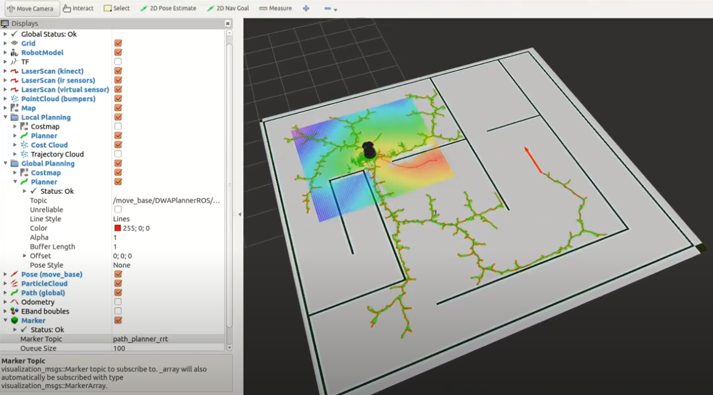
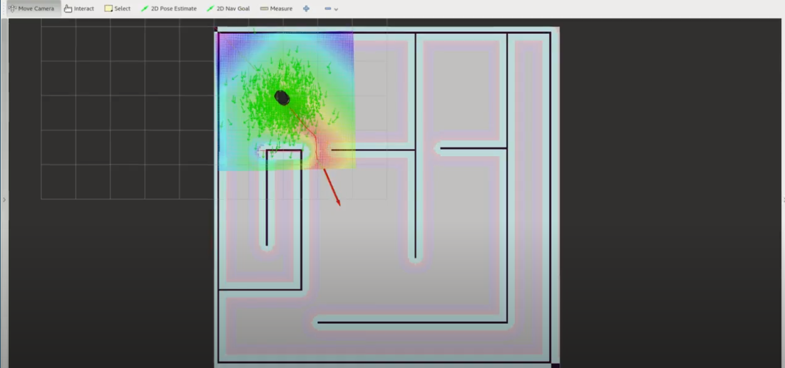
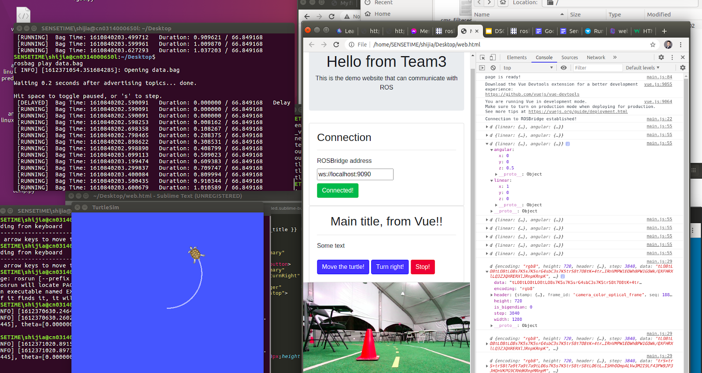

Project Repo: [https://github.com/dannyluo12/Autonomous_robot_data_visualization_and_interface](https://github.com/dannyluo12/Autonomous_robot_data_visualization_and_interface)

## Catalog

* [Project Goal](#goal)
* [Background](#Background)
* [Visualizations](#Visualizations)
* [Interface](#Interface)
* [Results/Impact](#Results)
* [Conclusions](#Conclusions)
* [References](#References)
* [Members](#Members)

## <a name = "goal" />Project Goal:
The goal of this project is to create visualizations and an interactive interface to enable our team and other autonomous navigation teams to be successful in autonomous navigation applications. 

## <a name = "Background" />Background:
Path planning and obstacle avoidance are important aspects of autonomous driving with regards to efficient routing and passenger safety. In order to travel from one point to another, GPS, IMU, and other sensors/applications have to work in unison in order to achieve this goal. Along the distance traveled, it is highly probable that obstacles will occur, deterring the original path intended for the vehicle to best travel. In order to address these issues, teams working on autonomous navigation must be able to visualize and interact with the robot. Different algorithms such as A* and RRT* are implemented to create path planning and obstacle avoidance. Visualizations of these respective algorithms and a user interface to send/receive commands will help to perform better tests, debug unexpected behavior, and improve upon existing autonomous navigation models. Using a controlled map with simulated obstacles, generated through a gazebo simulation, visualizations of the path planning algorithms will be shown, and their efficiencies will be discussed.

## <a name = "Visualizations" />Visualizations:
Below, an image of the test track utilized to test navigation algorithms is displayed:

  

    
  

Below, a gif is provided to visualize how the RRT* algorithm will navigate from one point to another:

  

    
  

## <a name = "Interface" />Simulations & Interface:
Below, an image of the RRT* algorithm tested in Gazebo simulator:

  

    
  

Below, an image of the A* algorithm tested in Gazebo simulator:

  

    
  

Below, an image of the Interactive interface website:

  

    
  

## <a name = "Results" />Results & Impact: 
Due to the restrictions of the pandemic, our group is testing path planning algorithms using an on-line simulator called Gazebo. The Gazebo simulator allows us to create robots and racetracks that can be used to simulate different path planning algorithms. The path planning algorithms we are using is based on GMapping, which is a lidar-based simultaneous locazliation and mapping method that creates a 2-D grid map of the given simulated track. After the grid map is created, our group tested a sampling-based algorithm called RRT*, and a search-based algorithm called A*. Testing out different algorithms are important, because different race tracks have unique characteristics, and one algorithm may be more advantageous than another. Along with the python visualizations and Gazebo simulated algorithms, our group is currently creating an interactive interface that allows the users to to choose what algorithn they believe is the most efficient using this interface. The interface will display metrics that will help determine the user what the best-fit algorithm is, along with visualiztions of the algorithms through the Gazebo simulator and python visualizer shown above.

## <a name = "Conclusions" />Conclusions:
Our team's final goal is to create an interactive interface that will allow the user to view different visualizations and metrics of unique algorithms that will be used for autonomous navigation in different unique race tracks. This interactive interface will allow the user to choose the most efficient algorithm. Much more progress is needed to complete different autonomous navigation as well as visualizing these navigation algorithms, but our group is on the correct track to achieve our set goals. 

## <a name = "Reference" />References:
* [1. Gazebo Simulator]   
* [2. TurtleBot Robots wiki]   
* [3. F1 Tenth Racing]  
* [4. G-Mapping wiki]  
* [5. RViz wiki]    
* [6. Roslibjs wiki]   
* [7. A. A. Zhilenkov and I. R. Epifantsev. "Problems of a trajectory planning in autonomous navigation systems based on technical vision and AI." 2018,]  
* [8. Motion Planning for Urban Driving using RRT,]  
* [9. D. Ma and N. Zhou. “Web-Based Robot Control and Monitoring.” 2019,]   

[1. Gazebo Simulator]: http://gazebosim.org/tutorials?tut=ros_overview
[2. TurtleBot Robots wiki]:http://wiki.ros.org/Robots/TurtleBot
[3. F1 Tenth Racing]:https://f1tenth.dev/
[4. G-Mapping wiki]: http://wiki.ros.org/gmapping
[5. RViz wiki]: http://wiki.ros.org/rviz
[6. Roslibjs wiki]: http://wiki.ros.org/roslibjs
[7. A. A. Zhilenkov and I. R. Epifantsev. "Problems of a trajectory planning in autonomous navigation systems based on technical vision and AI." 2018,]: https://ieeexplore.ieee.org/abstract/document/8317265
[8. Motion Planning for Urban Driving using RRT,]: http://acl.mit.edu/papers/KuwataIROS08.pdf
[9. D. Ma and N. Zhou. “Web-Based Robot Control and Monitoring.” 2019,]: http://www.cs.binghamton.edu/~szhang/teaching/18spring/reports/Luo-Ma-Zhou.pdf

## <a name = "Members" />Members: 

Yuxi Luo A14862234 
Seokmin Hong A14614169 
Jia Shi A15233744 
